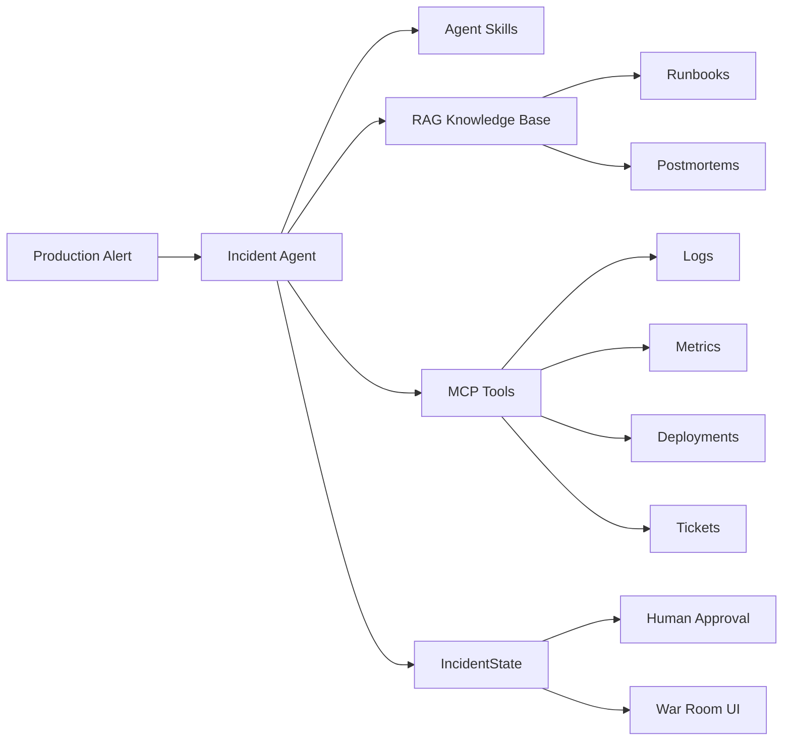
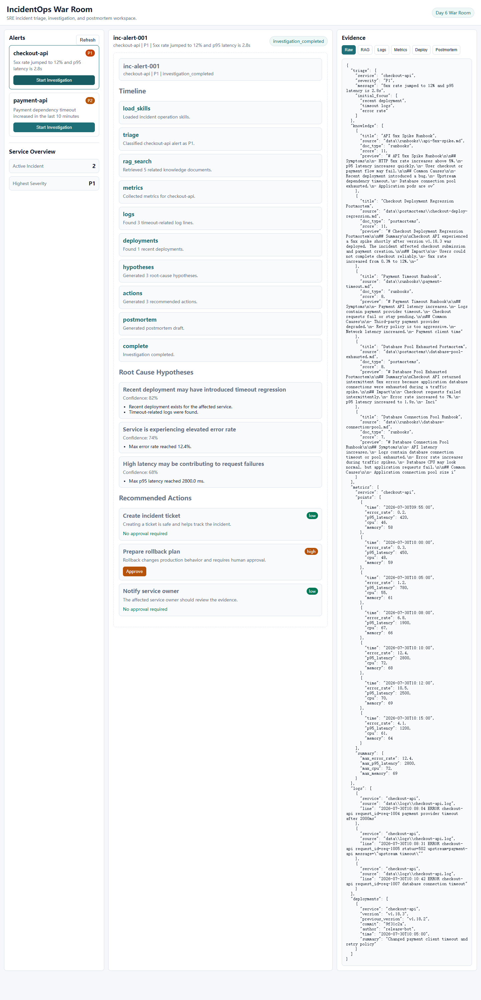
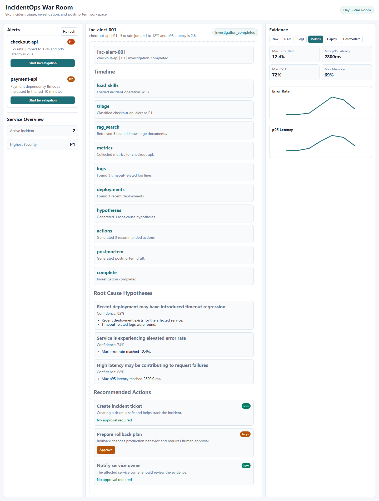
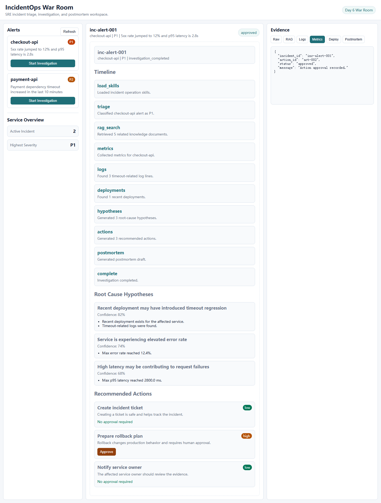

# IncidentOps Agent

IncidentOps Agent 是一个面向 SRE / 运维场景的生产事故分析与处置 Agent。

当系统出现接口 5xx、服务超时、延迟升高或部署异常时，Agent 会从生产告警出发，检索运维知识库，调用日志、指标和部署记录工具，分析可能的故障原因，并生成可追溯的处置建议与事故复盘草稿。

项目重点不是简单的聊天问答，而是展示一个具备**知识检索、工具调用、状态管理、风险控制和可视化界面**的完整 Agent 工作流。

## 项目能力

### 1. 告警分诊

- 展示模拟生产环境中的服务告警
- 识别异常服务、严重级别和故障症状
- 根据告警内容确定初始排查方向

### 2. RAG 运维知识检索

- 检索 Runbook 运维手册
- 检索历史事故复盘文档
- 返回命中文档、来源、类型、相关性分数和内容摘要
- 为根因分析和处置建议提供可追溯依据

### 3. MCP 工具调用

项目通过 MCP 封装外部系统能力，为 Agent 提供以下工具：

- 日志查询
- 指标查询
- 部署记录查询
- 事故工单创建

当前项目使用本地日志、CSV 指标和 JSON 文件模拟生产系统。工具接口可以进一步替换为 Elasticsearch、Prometheus、Jenkins、GitHub 或 Jira 等真实系统。

### 4. Agent 事故调查流程

Agent 会按照 SRE 事故调查流程自动组织证据：

```text
生产告警
  -> 告警分诊
  -> 检索 Runbook 和历史复盘
  -> 查询服务指标
  -> 搜索服务日志
  -> 检查最近部署
  -> 生成根因假设
  -> 生成处置建议
  -> 生成事故复盘草稿
```

每次调查都会保存到 `IncidentState`，包括：

- 告警信息
- 调查时间线
- RAG 命中文档
- 日志、指标和部署证据
- 根因假设
- 推荐处置动作
- Postmortem 草稿

### 5. Skill 驱动的操作规范

项目使用 Skill 将 SRE 操作流程结构化：

| Skill | 作用 |
| --- | --- |
| `triage-alert` | 识别服务、严重级别和初始排查方向 |
| `investigate-root-cause` | 收集证据并生成根因假设 |
| `safe-remediation` | 区分低风险和高风险处置动作 |
| `write-postmortem` | 根据调查结果生成事故复盘草稿 |

### 6. 人工审批与风险控制

Agent 会区分不同风险等级的动作：

- 创建工单、通知负责人：低风险动作
- 回滚部署、修改生产配置、执行数据库操作：高风险动作

高风险动作不会被 Agent 直接执行，必须经过人工审批。当前项目会记录审批结果，并在界面中展示审批状态。

### 7. IncidentOps War Room

项目提供一个 HTML War Room 界面，用于展示完整的事故调查过程：

- 左侧：告警列表和服务概览
- 中间：Agent 调查时间线、根因假设和处置建议
- 右侧：RAG、日志、指标、部署和 Postmortem 证据
- 操作区域：高风险动作的人工审批

## 系统架构



## 技术栈

- **后端**：Python、FastAPI、Pydantic、Uvicorn
- **Agent**：自定义状态机、Skill Loader、IncidentState
- **RAG**：Markdown 文档、本地知识索引、关键词相关性检索
- **工具协议**：MCP、FastMCP
- **数据存储**：SQLite、JSON、CSV、Log 文件
- **前端**：HTML、CSS、原生 JavaScript、SVG Sparkline
- **工程协作**：Git、GitHub、Pull Request

## 项目结构

```text
incidentops-agent/
├── agent/
│   ├── graph.py                 # Agent 调查流程和状态机
│   ├── skill_loader.py          # 加载 skills/*/SKILL.md
│   └── state.py                 # IncidentState 数据模型
├── apps/
│   ├── api/
│   │   ├── incident_store.py    # SQLite 事故状态和事件存储
│   │   └── main.py              # FastAPI 接口
│   └── web/
│       ├── app.js               # War Room 交互逻辑
│       ├── index.html           # War Room 页面
│       └── styles.css           # 页面样式
├── data/
│   ├── logs/                    # 模拟服务日志
│   ├── metrics/                # 模拟指标 CSV
│   ├── postmortems/             # 历史事故复盘
│   ├── runbooks/                # 运维 Runbook
│   ├── deployments.json         # 部署记录
│   ├── knowledge_index.json     # RAG 知识索引
│   └── tickets.json             # 模拟事故工单
├── mcp_servers/                 # MCP 工具服务
├── rag/                         # 知识索引构建和检索
├── scripts/                     # Agent 和 MCP 演示脚本
├── skills/                      # SRE Skill 定义
├── tests/                       # 自动化测试
├── docs/                        # 演示文档和截图
├── README.md
└── requirements.txt
```

## 界面展示

### IncidentOps War Room



### 指标证据



### 人工审批



## 快速启动

### 1. 创建并激活虚拟环境

```powershell
python -m venv .venv
.\.venv\Scripts\activate
```

### 2. 安装依赖

```powershell
pip install -r requirements.txt
```

### 3. 构建 RAG 知识索引

```powershell
python -m rag.ingest
```

### 4. 启动服务

```powershell
python -m uvicorn apps.api.main:app --reload
```

启动后访问：

- War Room：`http://127.0.0.1:8000`
- API 文档：`http://127.0.0.1:8000/docs`

## 演示流程

1. 打开 IncidentOps War Room。
2. 选择 `checkout-api` 或 `payment-api` 告警。
3. 点击 `Start Investigation`。
4. 查看 Agent 调查时间线和根因假设。
5. 查看 RAG、日志、指标和部署证据。
6. 查看推荐处置动作和事故复盘草稿。
7. 对高风险动作点击 `Approve`，观察人工审批结果。

## API 接口

| 方法 | 路径 | 说明 |
| --- | --- | --- |
| GET | `/api/health` | 健康检查 |
| GET | `/api/alerts` | 获取告警列表 |
| GET | `/api/alerts/{alert_id}` | 获取告警详情 |
| GET | `/api/rag/search?query=...` | 检索运维知识库 |
| GET | `/api/tools/logs` | 查询服务日志 |
| GET | `/api/tools/metrics` | 查询服务指标 |
| GET | `/api/tools/deployments` | 查询部署记录 |
| POST | `/api/tools/tickets` | 创建事故工单 |
| POST | `/api/incidents/start` | 启动事故调查 |
| GET | `/api/incidents/{incident_id}` | 获取事故状态 |
| GET | `/api/incidents/{incident_id}/events` | 获取调查时间线 |
| POST | `/api/incidents/{incident_id}/approve` | 审批高风险处置动作 |

## 项目亮点

- **面向真实生产场景**：围绕告警、日志、指标、部署和事故复盘构建完整闭环。
- **证据驱动分析**：根因假设和处置建议都关联具体检索结果与工具证据。
- **Agent 能力完整**：同时覆盖 Skill、RAG、MCP、状态管理和人工审批。
- **风险可控**：高风险生产动作必须经过人工确认。
- **界面可演示**：通过 War Room 直观展示 Agent 的调查过程和决策依据。
- **易于扩展**：本地模拟数据可以替换为真实监控、日志、CI/CD 和工单系统。

## 演示文档

完整演示流程和面试讲解见：[docs/demo-script.md](docs/demo-script.md)
