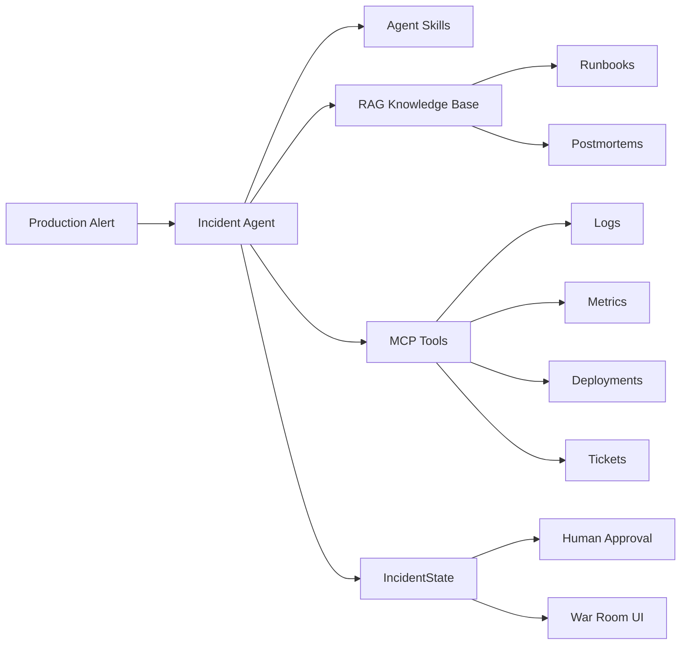

# IncidentOps Agent

IncidentOps Agent 是一个面向 SRE / 运维场景的事故指挥 Agent 项目。

系统从生产告警出发，通过 RAG 检索 Runbook 和历史事故复盘，调用 MCP 工具查询日志、指标和部署记录，随后生成根因假设、处置建议和事故复盘草稿。对于回滚等高风险动作，系统会要求人工审批，避免 Agent 直接执行危险操作。

## 项目特点

- 不只是聊天或问答，而是一个完整的事故调查工作流
- 使用 RAG 检索 Runbook 和历史事故复盘
- 使用 MCP 封装日志、指标、部署和工单等外部工具
- 使用 Skill 固化告警分诊、根因调查、安全处置和复盘流程
- 使用状态机记录 Agent 的调查步骤、证据、假设和动作
- 使用 SQLite 保存事故状态和事件时间线
- 高风险操作需要人工审批
- 提供 IncidentOps War Room 可视化展示界面

## 工作流程

```text
生产告警
   |
   v
告警分诊 Skill
   |
   v
RAG 检索 Runbook 和历史复盘
   |
   v
MCP 查询日志、指标和部署记录
   |
   v
生成根因假设和证据链
   |
   v
生成安全处置建议
   |
   +---- 低风险动作：直接建议
   |
   +---- 高风险动作：等待人工审批
   |
   v
生成 Postmortem 复盘草稿
```

## 技术栈

- 后端：Python、FastAPI、Pydantic、Uvicorn
- Agent：自定义状态机、Skill Loader
- RAG：Markdown 文档、本地知识索引、关键词相关性检索
- MCP：Python MCP SDK、FastMCP
- 数据存储：SQLite、JSON、CSV、Log 文件
- 前端：HTML、CSS、原生 JavaScript、SVG Sparkline
- 工程协作：Git、GitHub、Pull Request

## 项目结构

```text
incidentops-agent/
├── agent/
│   ├── __init__.py
│   ├── graph.py                 # Agent 调查流程和状态机
│   ├── skill_loader.py          # 加载 skills/*/SKILL.md
│   └── state.py                 # IncidentState 数据模型
├── apps/
│   ├── __init__.py
│   ├── api/
│   │   ├── __init__.py
│   │   ├── incident_store.py    # SQLite 事故状态和事件存储
│   │   └── main.py              # FastAPI 接口与静态页面入口
│   └── web/
│       ├── app.js               # 告警、调查、证据和审批交互
│       ├── index.html           # IncidentOps War Room 页面
│       └── styles.css           # War Room 页面样式
├── data/
│   ├── logs/                    # 模拟服务日志
│   ├── metrics/                 # 模拟服务指标 CSV
│   ├── postmortems/             # 历史事故复盘文档
│   ├── runbooks/                # 运维 Runbook 文档
│   ├── deployments.json         # 模拟部署记录
│   ├── knowledge_index.json     # RAG 本地知识索引
│   └── tickets.json             # 模拟事故工单
├── mcp_servers/
│   ├── __init__.py
│   ├── deploy_server.py         # 部署记录 MCP Server
│   ├── logs_server.py           # 日志查询 MCP Server
│   ├── metrics_server.py        # 指标查询 MCP Server
│   ├── ticket_server.py         # 工单 MCP Server
│   └── tool_logic.py            # MCP 工具核心逻辑
├── rag/
│   ├── __init__.py
│   ├── ingest.py                # 文档读取和知识索引构建
│   └── retrieve.py              # RAG 检索逻辑
├── scripts/
│   ├── __init__.py
│   ├── demo_agent.py            # 完整 Agent 调查流程演示
│   └── demo_mcp_tools.py        # MCP 工具调用演示
├── skills/
│   ├── investigate-root-cause/
│   │   └── SKILL.md
│   ├── safe-remediation/
│   │   └── SKILL.md
│   ├── triage-alert/
│   │   └── SKILL.md
│   └── write-postmortem/
│       └── SKILL.md
├── .gitignore
├── README.md
└── requirements.txt
```

## 已实现功能

### Day 1：项目骨架和基础页面

- 初始化项目目录和 Git 仓库
- 创建 FastAPI 后端服务
- 添加健康检查和模拟告警接口
- 创建基础 HTML Dashboard
- 在浏览器中展示告警列表和告警详情

### Day 2：RAG 知识库

- 创建 Runbook 和历史事故复盘文档
- 实现 Markdown 文档读取和本地知识索引
- 实现关键词相关性检索
- 添加 `/api/rag/search` 检索接口
- 支持返回文档来源、类型、相关性分数和内容预览

### Day 3：MCP 工具服务

- 准备模拟生产日志、服务指标和部署记录
- 实现日志查询 MCP 工具
- 实现指标查询 MCP 工具
- 实现部署记录 MCP 工具
- 实现事故工单 MCP 工具
- 添加 `scripts/demo_mcp_tools.py` 工具验证脚本
- 添加工具验证 API

### Day 4：Skill 和 Agent 状态机

- 创建告警分诊、根因调查、安全处置和复盘生成 Skill
- 实现 Skill Loader
- 定义 `IncidentState` 状态模型
- 将 RAG 检索和 MCP 工具串入 Agent 调查流程
- 生成调查时间线、证据、根因假设和处置建议
- 根据风险级别标记是否需要人工审批
- 自动生成 Postmortem 复盘草稿
- 添加 `scripts/demo_agent.py` 完整流程演示

### Day 5：事故 API、持久化和人工审批

- 添加启动事故调查接口
- 添加事故详情和事件时间线接口
- 使用 SQLite 保存 IncidentState 和调查事件
- 实现高风险动作人工审批接口
- 前端支持 `Start Investigation`
- 前端展示 Timeline、Root Cause Hypotheses 和 Recommended Actions
- 前端支持点击 `Approve` 记录人工审批结果

### Day 6：IncidentOps War Room

- 将基础页面升级为 IncidentOps War Room
- 增加告警和服务概览
- 增加当前事故状态栏
- 增加 Raw、RAG、Logs、Metrics、Deploy 和 Postmortem 证据标签
- 支持查看 RAG 命中文档和日志证据
- 支持查看指标摘要和 SVG 趋势图
- 支持查看部署记录和复盘草稿
- 保留高风险动作人工审批机制

## Skill 列表

| Skill | 作用 |
| --- | --- |
| `triage-alert` | 识别服务、严重级别、症状和初始排查方向 |
| `investigate-root-cause` | 按流程收集证据并生成根因假设 |
| `safe-remediation` | 区分高低风险动作并要求必要的人工审批 |
| `write-postmortem` | 根据事故状态生成结构化复盘草稿 |

## MCP 工具列表

| MCP 工具 | 作用 | 当前模拟数据源 |
| --- | --- | --- |
| Logs Server | 按服务和关键词查询日志 | `data/logs/*.log` |
| Metrics Server | 查询错误率、延迟、CPU 和内存 | `data/metrics/*.csv` |
| Deploy Server | 查询服务最近部署记录 | `data/deployments.json` |
| Ticket Server | 创建事故工单 | `data/tickets.json` |

这些工具以后可以分别替换为 Elasticsearch、Prometheus、GitHub/Jenkins 和 Jira，而不需要重写 Agent 主流程。

## 快速启动

### 1. 创建并激活虚拟环境

```powershell
python -m venv .venv
.\.venv\Scripts\activate
```

### 2. 安装依赖

```powershell
pip install -r requirements.txt
```

### 3. 构建 RAG 知识索引

```powershell
python -m rag.ingest
```

### 4. 启动服务

```powershell
python -m uvicorn apps.api.main:app --reload
```

打开 War Room：

```text
http://127.0.0.1:8000
```

打开 FastAPI 文档：

```text
http://127.0.0.1:8000/docs
```

## 演示流程

1. 打开 IncidentOps War Room。
2. 选择 `checkout-api` 或 `payment-api` 告警。
3. 点击 `Start Investigation`。
4. 查看 Agent 调查时间线和根因假设。
5. 切换 RAG、Logs、Metrics、Deploy 和 Postmortem 标签查看证据。
6. 对需要审批的高风险动作点击 `Approve`。
7. 查看审批结果和更新后的事故状态。

## API 接口

| 方法 | 路径 | 说明 |
| --- | --- | --- |
| GET | `/api/health` | 健康检查 |
| GET | `/api/alerts` | 获取模拟告警列表 |
| GET | `/api/alerts/{alert_id}` | 获取单条告警详情 |
| GET | `/api/rag/search?query=...` | 检索 Runbook 和历史事故复盘 |
| GET | `/api/tools/logs?service=...&keyword=...` | 查询服务日志 |
| GET | `/api/tools/metrics?service=...` | 查询服务指标 |
| GET | `/api/tools/deployments?service=...` | 查询部署记录 |
| POST | `/api/tools/tickets` | 创建事故工单 |
| POST | `/api/incidents/start` | 启动 Agent 事故调查 |
| GET | `/api/incidents/{incident_id}` | 获取事故完整状态 |
| GET | `/api/incidents/{incident_id}/events` | 获取事故调查时间线 |
| POST | `/api/incidents/{incident_id}/approve` | 审批高风险处置动作 |

## Agent 输出结构

一次完整调查会产生：

```text
IncidentState
├── alert
├── status
├── skills
├── timeline
├── evidence
│   ├── triage
│   ├── knowledge
│   ├── metrics
│   ├── logs
│   └── deployments
├── hypotheses
├── recommended_actions
└── postmortem
```

## 安全设计

- Agent 不允许虚构日志、指标或部署记录
- 根因假设必须附带证据
- 创建工单和通知属于低风险动作
- 回滚、生产配置修改和数据库操作属于高风险动作
- 高风险动作必须经过人工审批
- 当前项目只记录审批结果，不会真正执行生产回滚

## 项目架构图



## 界面截图

### IncidentOps War Room


### 指标证据


### 人工审批


## 演示脚本

项目演示脚本见：[docs/demo-script.md](docs/demo-script.md)

## 下一步计划

### Day 7：测试、评估和项目包装

- 增加 RAG 检索评估数据集
- 计算 Hit@3 / Hit@5
- 增加 Agent、MCP 工具和 FastAPI 接口测试
- 补充 War Room 截图和架构图
- 完善 GitHub 项目说明
- 准备面试演示脚本和常见追问答案

## 项目亮点

- 通过状态机实现可观察、可解释的 Agent 调查流程
- 使用 Skill 固化 SRE 标准操作流程
- 使用 MCP 解耦 Agent 与外部生产系统
- 使用 RAG 为根因分析提供历史经验和证据
- 使用人工审批控制高风险动作
- 通过 War Room 同时展示调查过程、证据链和最终建议
